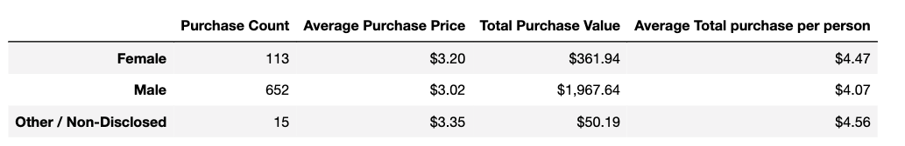
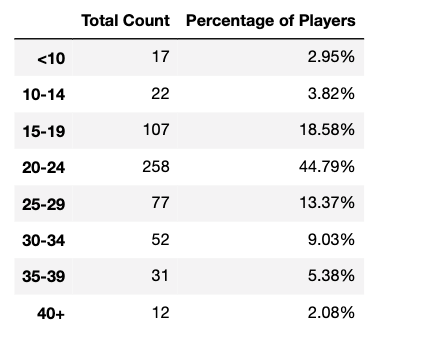
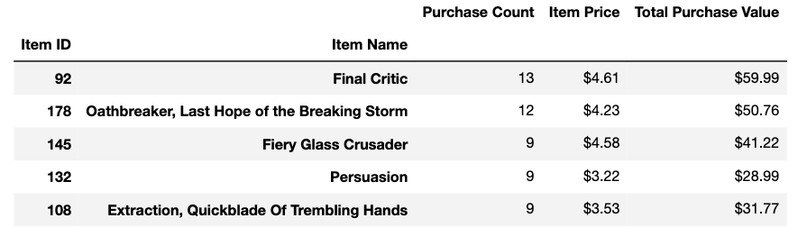

## Pandas Challenge

### Three conclusions from Heroes of Pymoli
* The majority of the players are male (84.03%), but the female players have a higher average purchase price of $3.20 and $4.47 of the average purchase price per person.

* The majority of the players are between 20 and 24 years old (44.79%), and players under ten years and more aged than 40 years old have lower participation with 2.95% and 2.08%, respectively.

* The most popular items and the most profitable are the same. This information helps us conclude that it is not only the price that affects profitability but also how many times the players purchase it.

